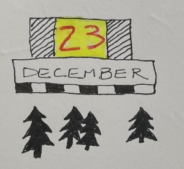

I write in my journal and in my zettelkasten to test my reflections. In doing so, I shape myself into a mature, intellectual craftsman. 

Historically, creatives keep journals or boxes of notes (a zettelkasten). This is a huge confidence builder; one becomes confident in one's uncertainty. 

##### Link: - Mills, C. Wright. “On Intellectual Craftsmanship (1952).” Society, vol. 17, no. 2, 1980, pp. 63–70, https://doi.org/10.1007/bf02700062.  
  
  
  ----------------------------------
  
#### Today doddle.

----------------------------------
<!--
## Source: Shape myself [[201901211027]] 01-21-2019

## See Also

## References

-->

