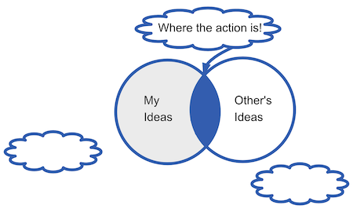

This is my first modern attempt at sketch-noting. It graphically portrays my idea. It would take a ton of words to explain. I want to build up my tool kit. 

This was posted in a thread talking about Permanent, Source, and Point notes and how they express my ideas, the ideas of others, and whether these can be considered original ideas. I'm thinking this is a red haring.    

##### Link: [Keeping Own Ideas in Zettelkasten? — Zettelkasten Forum](https://forum.zettelkasten.de/discussion/comment/22231/#Comment_22231)

----------------------------------
<!--
## See Also
- Make Useful Notes [[202412121808]]

## References
-->

