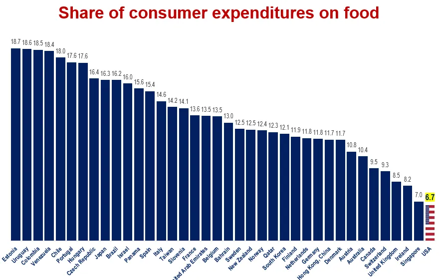

This infographic shows food spending is a lower percentage of a household's budget in the US than in many developed countries. 

A deep dive into the data shows the average American spends $3,382.00 annually or $65.00 weekly on food. This seems like it is not enough for a typical family to live on. I spend more than this. 

This is an isolated statistic that begs further study.
- Why do families in the poorest countries pay the most for food?
- How do health outcomes relate to food expenditures?
- Shouldn't we, in America, be paying more for our food?
- How much of the expenditure on food goes to unhealthy options?

This is the chart's [source](https://brucemehlman.substack.com/p/six-chart-sunday-45-reasons-for-thanks). 

##### Link:[The nature of growth – A Learning a Day](https://alearningaday.blog/2024/12/09/the-nature-of-growth/)

----------------------------------
<!--
## See Also
- Reducing food waste has unintended consequences [[202307301122]]
- Stock and Flow [[201901291200]]
- Precarity [[202007201008]]

## References
-->

