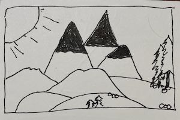

Velocity, as a mental model, defines a spectrum from stagnant to fleeting.

Velocity is the arrow pointing the way from here to there. In physics, it is the role of action and behavior. Everything has a velocity.

> It is also a metaphor for life. Consider it the rate at which we learn and grow, the speed at which we innovate and create, and the focus with which we pursue our goals.

Use velocity to help determine if you are traveling at the right speed, on the right trajectory, and carrying the right mass to move toward your goals. You must remain Bayesian in your thinking and not get carried away solely focused on your velocity. 

Velocity always has a direction. It matters where your velocity is taking you. Is it taking you towards your goals?
 
> Velocity is progress. Sometimes, progress comes from adding more force, and sometimes, progress comes from removing friction. Once you have a destination, you can improve your velocity by working harder and eliminating things that aren’t contributing toward reaching that goal. 

##### Link: [The Great Mental Models v2: Physics, Chemistry, and Biology](https://click.convertkit-mail4.com/8kuv83r8kboh04vp57f0fkwqe399c3/6qheh8h79r7r68so/aHR0cHM6Ly9mcy5ibG9nL3RnbW0v) 

----------------------------------
<!--
## Source: Shane Parrish

## See Also
- Do Ten Times as Much [[202412040756]]
    - Doing more practice than everyone else is the way to get better than everyone else.

## References

-->

