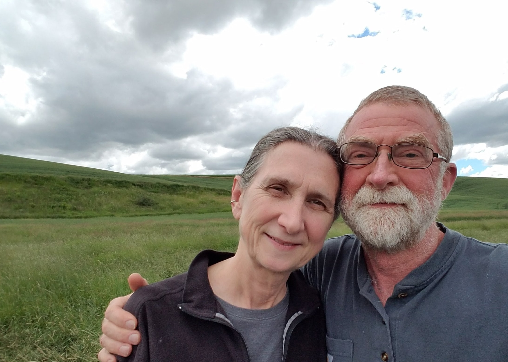

# Musings on writing, making, and wandering.

These are my notes.  

Hello. I’m Will. What really matters to me is a way to know me.

My wife, Mary, matters. She is my hazel-eyed girl with an enormous heart. Her love constantly reminds me of the beauty in me. Being with Mary extends my life expectancy, I’m sure.

Journaling matters. Bear is now my preferred journaling platform. I quietly express my experiences in my journal. Journaling is the best part of my day. It satisfies my technical itch and is not only my journal but also my external brain.

Reading matters. Reading is the only thing that separates me from ignorance. Reading has evolved my worldview. It is how I build models to use in relating to others. I am currently reading Middlemarch by George Eliot. Reading is my superpower. It's not that I'm great at it; instead, it's the most super part of me. 

Smiling matters. Connecting with you matters. A smile compounds its warmth. I give one and see one in return. There is a never-ending supply of smiles.

Walking matters. This is a keystone habit that bleeds into all areas of my life. 

Focus matters. I used to be more reserved and distracted. I missed out on a lot because of it. I’m trying to focus on what matters more. Living a meaningful life is not a matter of compounding activities but compounding meaning.

Living a meaningful life matters. This is an area of continuous exploration. I continue to learn and be exposed to fresh ideas about this critical life skill. I used to focus on things in my life that didn’t work. Now, I try to quickly let go of notions and actions that don’t work, grasp what really matters, and live honestly. 

My workshop is in Moscow, Idaho. I started woodworking and woodturning in the early 1980s and continue to do so today. 

----------------------------------

