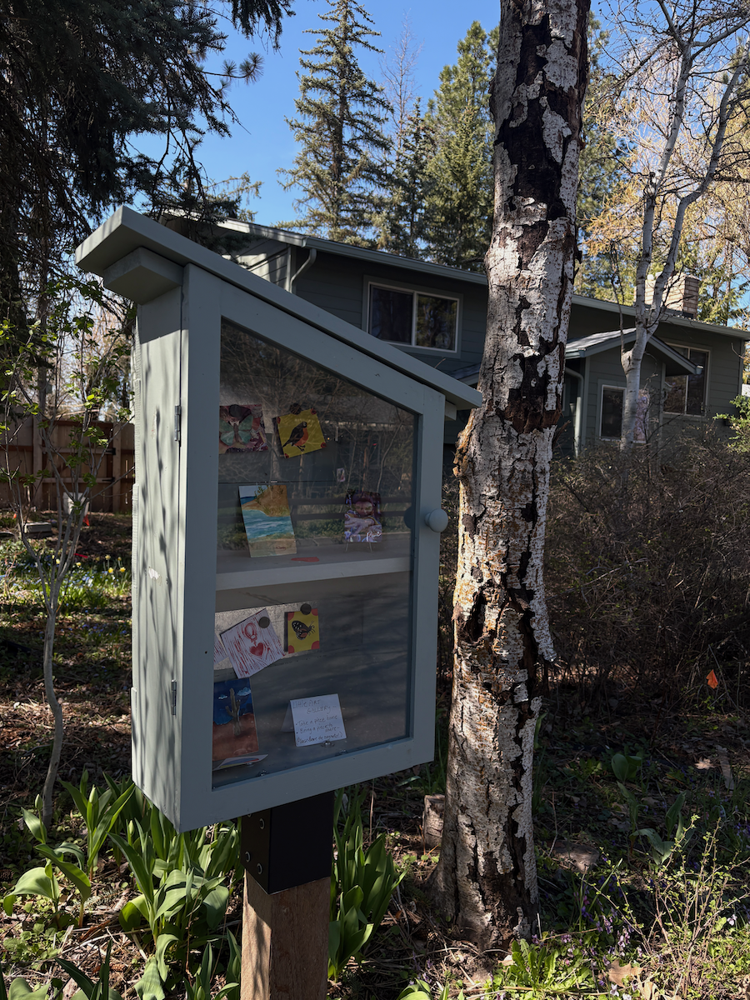

## My Now Page
Last Updated: 2026.05.17
# What I’m Doing Now. 
- My dust collection system is set up and working.
- Walking is more enjoyable than ever. Zivon is spending a lot of time with his drag leash. We are interacting more, and that keeps his attention on the walk. I take him on a sniffari and that keeps him happy.
  
#### READING
- Seeing That Frees: Meditations on Emptiness and Dependent Arising by Rob Burbea — First Reading 3/17/2026 - 
- Hadas, Rachel. Strange Relation: A Memoir of Marriage, Dementia, and Poetry. 1st Paul Dry Books ed, Paul Dry Books, 2011. May 4, 2026 
- Hanh, Thich Nhat. Living Buddha, Living Christ 20th Anniversary Edition. With Elaine Pagels and David Steindl-Rast, 20th ed, Penguin Publishing Group, 2007. - Pair Reading with Rich — May 15, 2026 
- Shukman, Henry. Original Love: The Four Inns on the Path of Awakening. 1st ed, HarperCollins Publishers, 
- 2024. - Pair Reading with Joe — May 15, 2026
- A Monster Calls by Patrick Ness — May 31, 2026 

#### HEALTH & VISION
    - I've been focusing on my step count — 12,481 average steps per day this week. This is something I want to focus on and keep up. This will mean I will be walking without Zivon and Mary, taking the bus downtown and walking back. I'm going to institute a 10-minute "fart" post-dinner walk with Zivon.
  > "I have two doctors, my left leg and my right." – George Macaulay Trevelyan, Walking, 1913
 > "Your feet are your best friends. They tell you who you are." - Erling Kagge

#### WOODWORKING
- Rakusu ring orders have been piling up. I've started a little art project, making little finials as standalone artifacts. The first one I'm going to put in the Little Free Art Exchange on the path to the bus stop.

---
Hat tip to David Sparks for the idea for [this “Now” page](https://www.macsparky.com/now/). I’m not great at social media, but this page lets me check in with the world and update you, as David recommends, just as I would when catching up with an old friend.

